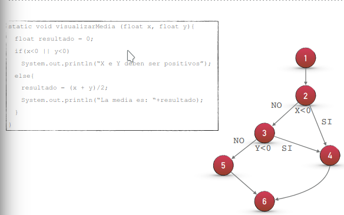

<h1>OBTENCIÓN DE LOS CASOS DE PRUEBA EJEMPLO 2</h1>

<h6>Caminos :</h6>

 :one: Camino : <b>1-2-3-5-6</b>

 :two: Camino : <b>1-2-3-4-6</b>

 :three: Camino : <b>1-2-4-6</b>

 | Caminos | Casos de prueba | Resultado esperado |
|----------|----------|----------|
| 1    | Si x<0 no cumple la condición, pasa a comprobar y<0. Si este tampoco cumple, pasamos al 'else' y termina el programa.|👉  Muestra el resultado de (x+y)/2 
| 2    |Si x<0 no cumple la condición, pasa a comprobar si y<0. Si este cumple, realiza el algoritmo que hay dentro del paso 4.  |👉 Nos dice que x e y deben ser positivos.
| 3    | i x<0, se cumple entra al paso 4, cumple las tareas y termina. |👉Nos dice que x e y deben ser positivos. 

