

* Realiza las acciones de gradle run y clean en helloGradle.
    
    - Sube el proyecto a la tarea.

:pencil2:Inicializamos el programa
    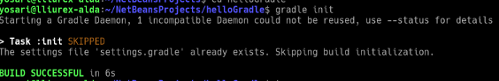
    
   :pencil2: Miramos donde se encuentra ubicado.
    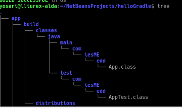

   :pencil2:    Ejecutamos el programa para ver los datos de salida.
    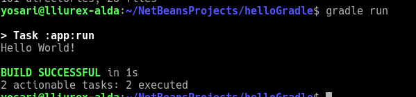    
    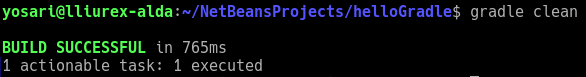

* Cread un proyecto con Gradle para vuestro código de la calculadora. A esta calculadora debéis añadirle ahora dos métodos adicionales:

   - public Boolean isPrime(float op1){...} 
   esta función nos devolverá un valor lógico, indicando si el número es primo o no (primo=divisible solo por él mismo y por 1).
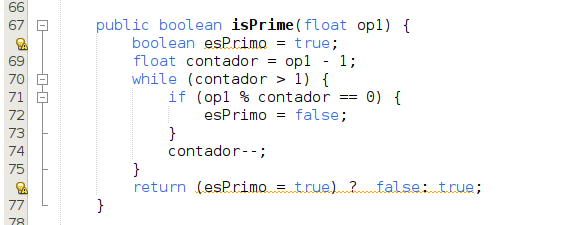

   - public Integer nextPrime(float op1){...}
    este método nos devolverá el siguiente número primo al que le indiquemos (si indicamos un número primo, nos devolverá el mismo).

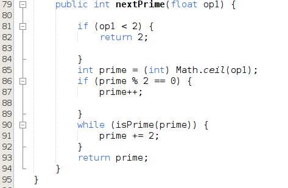

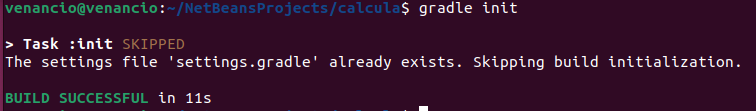

 :pencil2:Miramos donde se encuentra ubicado

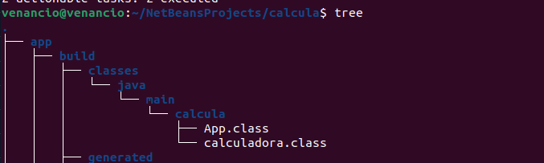

:pencil2: Pasamos los valores por el archivo build.gradle.

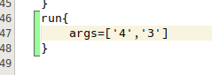

:pencil2:Importamos la libreria Math para llamar en el programa princial.

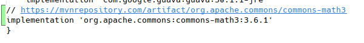
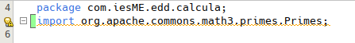

:pencil2:Pasamos los valores para poder ejecutar el programa. En este caso, son 4 y 3.

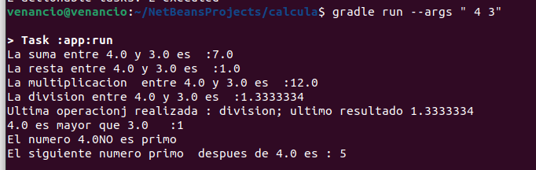
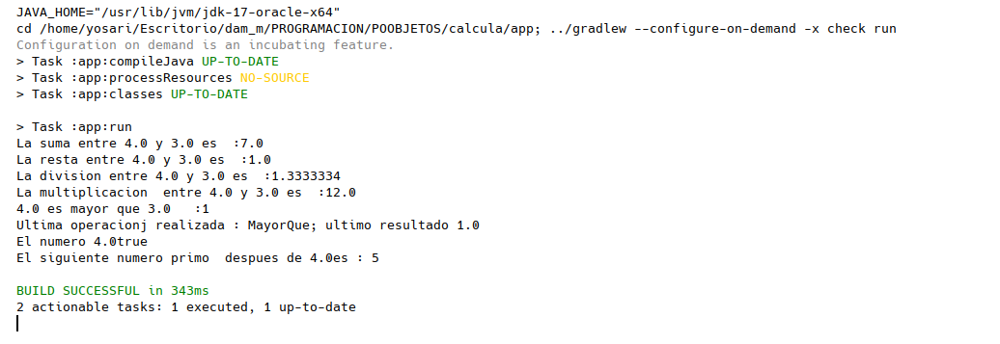

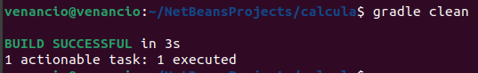