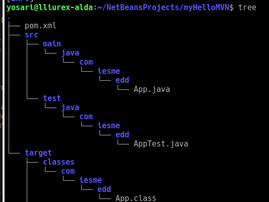
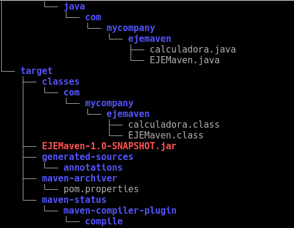

<h1>maven</h1>

:heavy_check_mark: Haz capturas de imágenes en el que muestres el uso de mvn compile, mvn clean, mvn package y la ejecución de “myhelloMVN”

* En el archivo pom.xml se agregó la linea llamada (<b>properties</b>)

<b>  maven compile</b>

<b>maven clean</b>

<b>maven package</b>

<b>hola Mundo</b>

:heavy_check_mark: A partir del código de la calculadora (de la práctica anterior), haz un proyecto maven en netbeans

   :pencil2: Haz capturas de parte del proceso (puedes hacer alguna captura de como inicias el proyecto más una breve explicación)

 :pencil2: Usa mvn compile, mvn clean, mvn package y su ejecución (hazlo con el comando java….)

 

* Empaquetamos el proyecto en un formato específico. 

* Después de hacer el comando tree. Seguimos la ruta para compilar.
