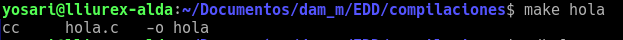
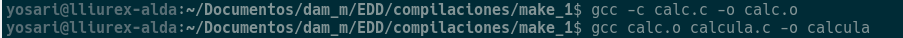
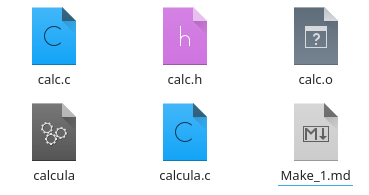
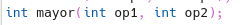
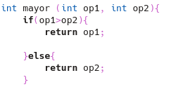
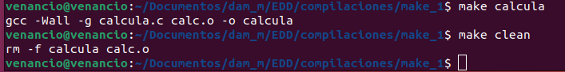
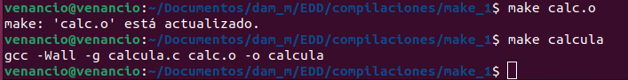

<h1>Herramientas de automatización</h1>

### To-do 1:

Pruebe a lanzar los comandos anteriores sobre el archivo hola.c .

Compruebe el resultado ejecutando los archivos compilados

### To-do 2:

Crea y compila el primer programa de la calculadora para verificar que funciona (calc.c, calc.h y calcula.c).

](image.png)

Añade una nueva función que sea “mayor”, que devolverá el número mayor

<b>calc.h</b>

<b>calc.c</b>

<b>calcula.c</b>

Compile el programa con la nueva función “mayor” y verifica que todo funciona correctamente.

.png>)

### To-do 3:

Cree el archivo Makefile e intente construir los diferentes objetivos, probando el resultado de make , make calcula y make calc.o . Borra todos los archivos objeto y ejecutables entre cada prueba.

Prueba a invertir el orden de las reglas en el Makefile , primero la regla de calc.o y después calcula . Ejecuta el make con este Makefile y explica los resultados.

- En la regla 1: "calcula " es la primera en el Makefile. Al ejecutar "make" construye "calcula"
- En la regla 2: "calc.o" es laprimera en el Makefile. Al ejecutar "make" construye calc.o si es necesario, luego se construirá "calcula" utilizando "calc.o" 

Restaurar el archivo Makefile con el mandato anterior.

### To-do 4:

Implementa las funciones “install” y “targz”, verifica que funciona

Diseña una nueva funcionalidad, “Readme”, donde se crea un archivo readme en formato markdown

- Comando:  echo “# Readme\n *** Important\n It’s a Readme”> Readme.txt

