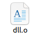

<h1>Simulacro de examen </h1>

<b>El entregable será un documento PDF donde indicaréis la actividad (1 y 2) y adjuntaréis las capturas que se piden en cada uno de los apartados. NO es necesario que los valores se pasen cómo parámetros, podéis poner los valores dentro del código fuente en las dos actividades.</b>

### 1. Realizar un programa en C dónde:

- El programa principal <b>principal.c</b> llamará a una función <b>SonIguales</b>(int x, int y) definida en <b>dll.h</b>

- El ficihero de <b>dll.c</b> es donde estará implementada esta funsión. La funsión simplemente comprobará si(x==y)y devolverá true or false segun corresponda.

- Genera el dll.o

- Crea un makefile solo para compilar y generar el programa ejecutable.

