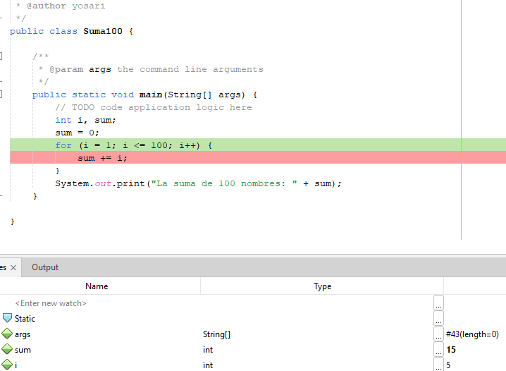
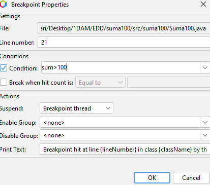
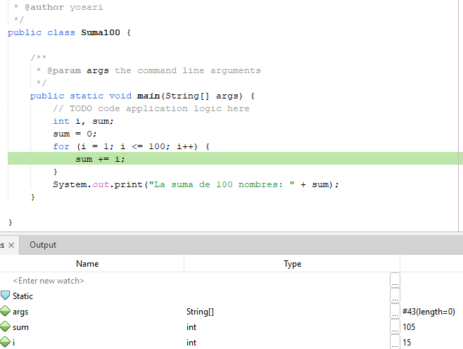
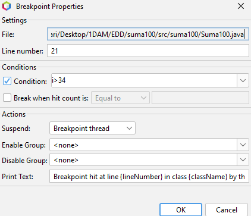
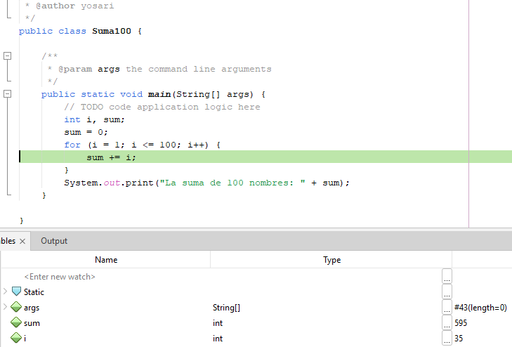

<h1>
Exercicis
</h1>

1. Crea un projecte java que calcule i mostre la suma dels 100 primers nombres

      package suma100;
      public class Suma100 {
       public static void main(String[] args) {
        int i, sum;
        sum=0;
        for(i=1;i<=100;i++){
          sum += i;
        }
        System.out.print("La suma de 100 nombres: "+sum);
      }
    }

2. Posa un Breakpoint en el lloc adient (sum) i executa 5 vegades el pas a pas,
fes captures de pantalla de la finestra variables per vore la evolució de la
variable on es guarda el valor de la suma.
 

 

3. Modifica les propietats del Breakpoint per a que s’ature automàticament quan
el valor acumulat siga superior a 100, fes una captura de pantalla de la
finestra variables.
 

 
 

4. Canvía la condició d’aturada. La nova condició serà que el número a sumar
siga major de 34. Fes una captura de pantalla de la nestra variables.
 

 
 