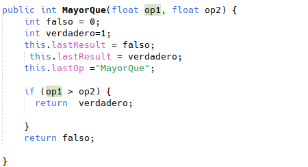

<h1>Compilaciones<h>

#### TO-DO

A partir del código proporcionado, implemente la nueva funcionalidad en la calculadora <b>mayorQue</b>,que indique si el primer argumento que le proporcionamos es mayor que el segundo. El tipo de valor de regreso deberá ser lógico (0 falso, 1 verdadero).

Ejecuta el código desde terminal, muestra todos los pasos que has hecho para obtener ese resultado (compilaciones…)

Ejecuta el código desde el IDE de Netbeans, muestra todos los pasos

Sube también el código generado a la tarea

